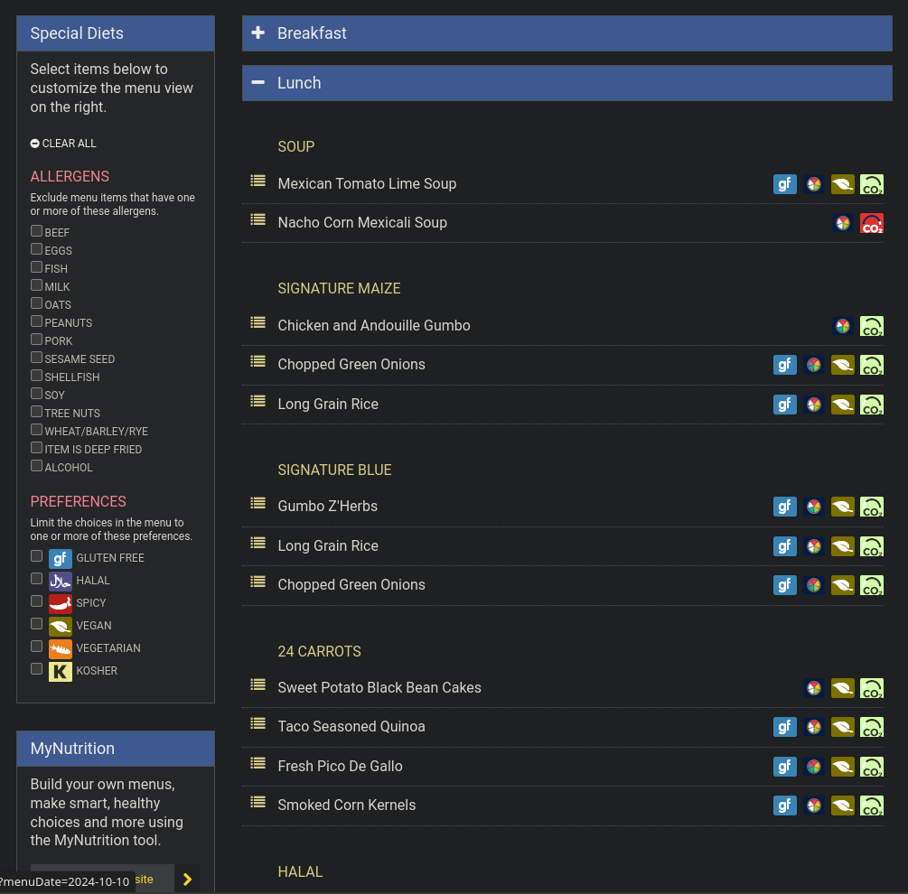
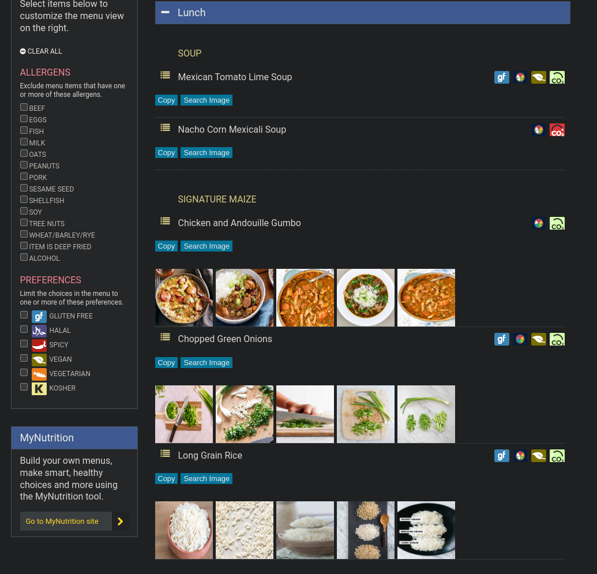

# Visualize UMich Dining

Ever found yourself wondering if today's food at UMich’s dining halls is tasty, but as a non-native speaker, you’re unsure what dishes like "Chicken and Andouille Gumbo" actually look like? Manually searching each item is tedious—**but this script makes it easy!**

Before:

After:

## Installation

1. Install a userscript manager like [Tampermonkey](https://www.tampermonkey.net/).
2. Add the script from [visualize_umich_dining.user.js](https://github.com/zpatronus/visualize_umich_dining/raw/main/visualize_umich_dining.user.js).
3. [Enable "developer mode"](https://www.tampermonkey.net/faq.php?locale=en#Q209) if needed.
4. Try it out at any [UMich dining hall menu page](https://dining.umich.edu/menus-locations/dining-halls/).
5. (Optional) [Get a Google API key for free](https://developers.google.com/custom-search/v1/introduction) and enter it in the API key input box in the bottom-right corner. The script will automatically fetch food images.
  - It seems that you can only get Google API key with your personal account instead of UMich account. 

## How It Works

- **Copy**: Instantly copies the food name to your clipboard.
- **Search Image**: Opens a Google Image search in a new tab.
- **Auto Image Search (with API Key, OPTIONAL)**:
  - [Get a Google API key for free](https://developers.google.com/custom-search/v1/introduction) and enter it in the API key input box in the bottom-right corner. The script will automatically fetch food images from sections like "Signature Maize," "Signature Blue," "Halal," "Two Oceans," "Wild Fire Maize," and "Wild Fire Blue."
  - You get up to 100 requests per day for free from Google!
  - **Image Caching**: Images are cached locally for up to 20 days, reducing API requests.

## License

Licensed under the MIT License. See the [LICENSE](LICENSE) file for details.
